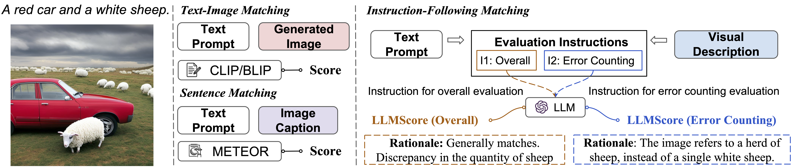
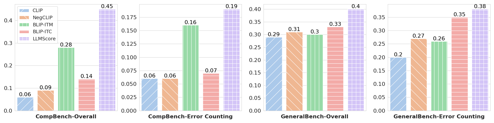

# LLMScore
<p align="center">
   🤗 <a href="https://yujielu10.github.io/" target="_blank">Demo [Coming Soon]</a> 📃 <a href="https://github.com/YujieLu10/LLMScore/tree/master/assets/T2I_LLMScore_preprint.pdf" target="_blank">Paper</a> 🐦 <a href="https://twitter.com/yujielu_10" target="_blank">Twitter</a><br>
</p>
In this work, we propose LLMScore, a new framework that offers evaluation scores with multi-granularity compositionality. LLMScore leverages the large language models (LLMs) to evaluate text-to-image models.
Please check out our paper <a href="https://github.com/YujieLu10/LLMScore/tree/master/assets/T2I_LLMScore_preprint.pdf" target="_blank">"LLMScore: Unveiling the Power of Large Language Models in Text-to-Image Synthesis Evaluation"</a>!

## Overview
The two images are generated using Stable-Diffusion-2 based on the text prompt sampled from the Concept Conjunction dataset. *Baseline* section shows the scores from the existing model-based evaluation metrics, *Human* section is the rating score from the human evaluation, *LLMScore* section is our proposed metric. The right column also shows the rationale generated by LLMScore.
<p align="center">
</img>
</p>
Comparison of Text-Image Matching, Sentence Matching, and our LLM-based Instruction-Following Matching pipeline for text-to-image synthesis evaluation. Our LLMScore automatically provides accurate scores and reasonable rationales for text-to-image synthesis based on text prompts, and visual descriptions following various evaluation instructions.
<p align="center">
</img>
</p>


## Installation
Please follow [install](INSTALL.md) page to set up the environments and models.

## Text-to-Image Synthesis Evaluation
Get score with rationale for evaluating the alignment between image and text prompt.
```
python llm_score.py --image sample/sample.png --text_prompt "a red car and a white sheep"
```

Try different LLMs by setting LLM_ID as one of ["gpt-4", "gpt-3.5-turbo", "vicuna"]:
```
python llm_score.py --image sample/sample.png --text_prompt "a red car and a white sheep" --llm_id LLM_ID
```

Notice that to use Vicuna, follow Part **Install** and Part **Model Weights** in [FastChat_README](https://github.com/lm-sys/FastChat) to install fastchat and to obtain the Vicuna weights.
To enable OpenAI-compastible APIs used in our repo, follow commands from [Guideline](https://github.com/lm-sys/FastChat/blob/main/docs/openai_api.md) to launch the controller, model worker and RESTful API server as below:
```
python3 -m fastchat.serve.controller
python3 -m fastchat.serve.model_worker --model-name 'vicuna-7b-v1.1' --model-path /path/to/vicuna/weights
python3 -m fastchat.serve.openai_api_server --host localhost --port 8000
```

## LLMScore with Rationale

<p align="center">
</img>
</p>

## Human Correlation

The rank correlation (Kendall's tau) is aggregated across the compositional prompt dataset (Concept Conjunction, Attribute Binding Contrast) on the left two columns (CompBench) and the general prompt dataset (MSCOCO, DrawBench, PaintSkills) on the right two columns (GeneralBench).
<p align="center">
</img>
</p>


## Citation

If you found this repository useful, please consider cite our paper:

```bibtex
@article{xiao2023fastcomposer,
            title={LLMScore: Unveiling the Power of Large Language Models in Text-to-Image Synthesis Evaluation},
            author={Yujie Lu, Xianjun Yang, Xiujun Li, Xin Eric Wang, William Yang Wang},
            journal={arXiv},
            year={2023}
          }
```


## Acknowledgement
This repo benefits from [BLIP-2](https://github.com/salesforce/LAVIS/tree/main/projects/blip2), [GRIT](https://github.com/JialianW/GRiT), [GPT-4](https://openai.com/research/gpt-4).
Thank for their awesome works!

